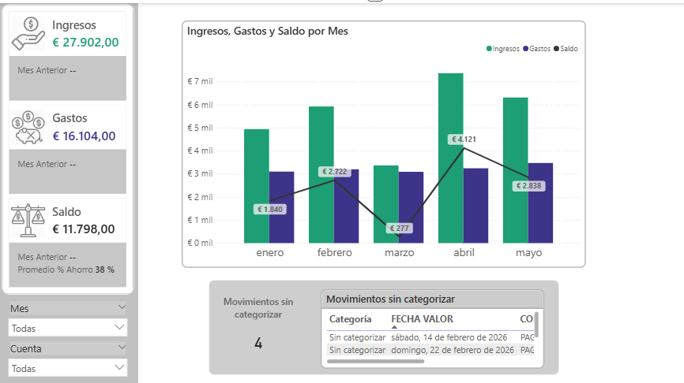
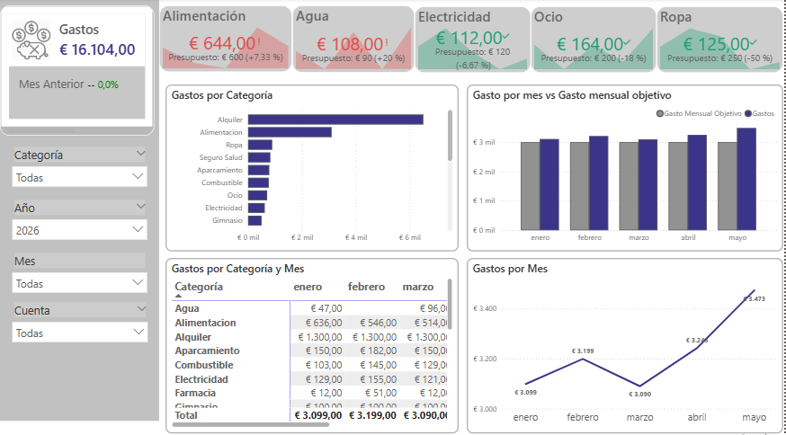
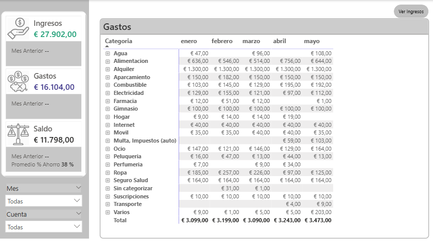

### Dashboard de Finanzas Personales — Power BI

> Los datos presentados en este proyecto son **ficticios** y fueron generados únicamente con fines demostrativos, preservando la estructura y lógica real del proyecto original.

#### Descripción

Dashboard desarrollado en Power BI que permite monitorear y analizar los movimientos bancarios de dos cuentas de forma consolidada. Cubre el seguimiento mensual de ingresos, gastos y ahorro, el control de gastos variables contra un presupuesto definido, y la comparación del gasto total contra un objetivo mensual máximo.

Inicialmente el seguimiento se realizaba manualmente en Excel. La migración a Power BI permitió automatizar la consolidación de archivos bancarios mensuales, aplicar categorización automática por palabras clave, y visualizar la información de forma interactiva.

**Problema que resuelve:** proporciona visibilidad sobre hábitos de gasto, cumplimiento de presupuesto y capacidad de ahorro mediante un seguimiento financiero automatizado.

#### Herramientas utilizadas

**Power BI Desktop** — modelado de datos, DAX, visualización

**Power Query (M)** — transformación y limpieza de datos

**Excel** — fuente de datos origen

#### 📊 Páginas del dashboard

#### 1. Resumen
Vista general del estado financiero mensual — ingresos, gastos, saldo y tasa de ahorro — con comparación contra el mes anterior y detección de movimientos sin categorizar.

#### 2. Gastos
Análisis detallado del gasto mensual por categoría, control de gastos variables contra presupuesto (Alimentación, Agua, Electricidad, Ocio, Ropa), evolución temporal del gasto total y comparación de gasto mensual contra objetivo.

#### 3. Detalle
Exploración detallada de todos los movimientos del período, permitiendo auditar el gasto por categoría, mes y fecha, e identificar movimientos específicos.

#### Aspectos técnicos destacados

Consolidación automática de archivos Excel mediante Power Query.

Categorización automática de movimientos por palabras clave.

Prevención de duplicados mediante claves únicas.

Comparativas temporales y métricas financieras desarrolladas en DAX.

#### Documentación completa

La documentación técnica detallada — modelo semántico, relaciones, medidas DAX, transformaciones de Power Query, decisiones de diseño y mejoras futuras — está disponible en [Informe_finanzas_personales.pdf](Informe_finanzas_personales.pdf).

---

📧 ¿Preguntas sobre el proyecto? Contactame en www.linkedin.com/in/mcelesteisaac o isaacmceleste@gmail.com

